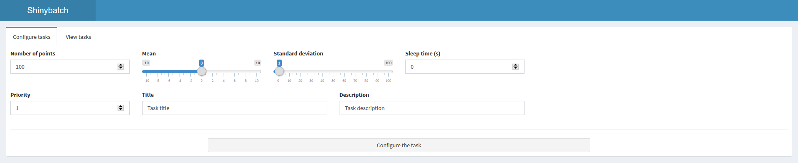
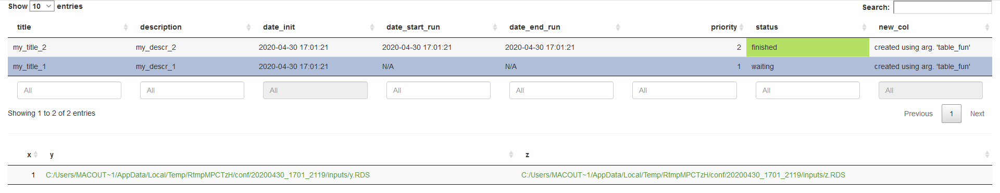

# shinybatch

This package provides a simple framework to create, launch *automatically* and retrieve *time-consuming operations* (tasks) **in batch mode** from a **Shiny app**.

The tasks are automatically launched using a CRON, e.g. a timer that periodically launches a (batch) operation.  

<br>

### Package functions

- **configure_task** : create a *.yml* file filed with operation parms (fun path, fun args, priority, ...),
- **run_task** : run a task from a *.yml* file,
- **launcher** : select and run the tasks with highest priority,
- **cron_init** : create the file to be launched by the *cron*,
- **cron_start** : (opt: create the cron file) and start the *cron* which will read the file at the given frequency to launch batch operations,
- **configure_task_server** : calls *configure_task()* in the Shiny app,
- **tasks_overview_server** : display tasks within the Shiny app.

<br>

### Definition of a task

A task is defined by its *.yml* file that contains the following informations :


<br>

The ``run_info`` part contains general information about the task.

Priority can be any number, with 0 as default. The highest the priority, the sooner it is launched.

Valid status are:

- **waiting**
- **running**
- **finished**
- **error**

The ``desccriptive`` part contains informations given by the user. The title and description fields are only example.

The ``function`` part contains the location of the fun script (for sourcing) and its name (for calling).

The ``args`` part contains either the location of the argument (in *dir_conf/inputs/arg_name.RDS*) or the argument itself if it is of length 1.

The ``dir`` argument contains the location of the directory in which is stored the *conf.yml* file.

<br>

When a task has been succesfully run, some fields are updated:

- date_start_run and date_end_run are filled,
- status is set to 'running' then to 'finished'.

Some outputs are created:

- the result of the task (in *dir_conf/output/res.RDS*)
- the log of the run (in *dir_conf/output/log_run.txt*)

<br>

### Description of the launcher

The launcher retrieves all the tasks in the directory and build a the table of their *run_info*. Based on this, it verifies that there are tasks with *status* that allow a run, e.g. all but those in *ignore_status*. Then, if the maximum number of simultaneously running tasks is not reached, it launches new tasks according to their priority.

The task with higher priority is defined as the one:

- with *status* not in *ignore_status* (default is all but **waiting**),
- which has the highest *priority*,
- and then the oldest *date_init*.

<br>

### Description of the CRON

Before calling the CRON, we first create the file that it will launch with **cron_init**. By default, it looks like this:


... but the head lines can be customized by filling the *head_rows* argument:


<br>

Once the file has been created, the cron is launched using the **cron_start** function. The default *cmd* argument is:
``Rscript /path/to/cron_script.R /path/to/conf 1``, 

with 2 args being the *conf.yml* directory an the maximum number of simultaneous running tasks at a given time... but it can be customized.

<br>

### Example

**Configure a task**
```{r}
# create temporary directory
dir <- tempdir()

# create and save conf
conf <- configure_task(dir_path = dir,
                       conf_descr = list(title = "my_title",
                                         description = "my_descr"),
                       fun_path = dir, # as an example,
                       fun_name = "my_fun_name",
                       fun_args = list(x = 1,
                                       y = 0:4,
                                       z = iris),
                       priority = 1)

# catch results
list.files(conf$dir, recursive = T)
(read_conf <- yaml::read_yaml(paste0(conf$dir, "conf.yml")))
(y <- readRDS(paste0(conf$dir, "inputs/y.RDS")))
(z <- readRDS(paste0(conf$dir, "inputs/z.RDS")))

# remove directory
unlink(dir, recursive = T)
```

<br>

**Run one given task**
```{r}
# create temporary directory for conf
dir_conf <- paste0(tempdir(), "/conf")
dir.create(dir_conf, recursive = T)

# create temporary directory for fun
dir_fun <- paste0(tempdir(), "/fun")
dir.create(dir_fun)
con <- file(paste0(dir_fun, "/fun_script.R"))
writeLines(c("my_fun <- function(x, y, z) {",
             "  res <- x + y ;",
             "  message('Running !') ;",
             "  res",
             "}"),
           con)
close(con)

# create and save conf
conf <- configure_task(dir_path = dir_conf,
                       conf_descr = list(title = "my_title",
                                         description = "my_descr"),
                       fun_path = paste0(dir_fun, "/fun_script.R"),
                       fun_name = "my_fun",
                       fun_args = list(x = 1,
                                       y = 0:4,
                                       z = iris),
                       priority = 1)

run_task(paste0(conf$dir, "conf.yml"))

# catch results
list.files(conf$dir, recursive = T)
(conf_update <- yaml::read_yaml(paste0(conf$dir, "conf.yml")))
(output <- readRDS(paste0(conf$dir, "output/res.RDS")))
(log <- read.delim(list.files(paste0(conf$dir, "output/"), pattern = "log_run", full.names = T), header = F))

# remove directory
unlink(dir_conf, recursive = T)
unlink(dir_fun, recursive = T)
```

<br>

**Run the task with higher priority**
```{r}
# create temporary directory for conf
dir_conf <- paste0(tempdir(), "/conf")
dir.create(dir_conf, recursive = T)

# create temporary directory for fun
dir_fun <- paste0(tempdir(), "/fun")
dir.create(dir_fun)
con <- file(paste0(dir_fun, "/fun_script.R"))
writeLines(c("my_fun <- function(x, y, z) {",
             "  res <- x + y ;",
             "  message('Running !') ;",
             "  res",
             "}"),
           con)
close(con)

# create 2 confs
conf_1 <- configure_task(dir_path = dir_conf,
                         conf_descr = list(title_1 = "my_title_1",
                                           description_1 = "my_descr_1"),
                         fun_path = paste0(dir_fun, "/fun_script.R"),
                         fun_name = "my_fun",
                         fun_args = list(x = 0,
                                         y = 0:4,
                                         z = iris),
                         priority = 1)
conf_2 <- configure_task(dir_path = dir_conf,
                         conf_descr = list(title_2 = "my_title_2",
                                           description_2 = "my_descr_2"),
                         fun_path = paste0(dir_fun, "/fun_script.R"),
                         fun_name = "my_fun",
                         fun_args = list(x = 1,
                                         y = 0:4,
                                         z = iris),
                         priority = 2)

launcher(dir_conf, verbose = T) # 1
Sys.sleep(1)
# display res of conf_2 in /output dir
(res_conf_1 <- readRDS(paste0(conf_2$dir, "output/res.RDS")))
yaml::read_yaml(paste0(conf_1$dir, "conf.yml"))$run_info$status # waiting
yaml::read_yaml(paste0(conf_2$dir, "conf.yml"))$run_info$status # finished

launcher(dir_conf, verbose = T) # 1
Sys.sleep(1)
# display res of conf_1 in /output dir
(res_conf_2 <- readRDS(paste0(conf_1$dir, "output/res.RDS")))
yaml::read_yaml(paste0(conf_1$dir, "conf.yml"))$run_info$status # finished
yaml::read_yaml(paste0(conf_2$dir, "conf.yml"))$run_info$status # finished

# no more task to run
launcher(dir_conf, verbose = T) # 0
# now allow to re-run finished tasks
launcher(dir_conf, ignore_status = c("running", "error"), verbose = T) # 1
Sys.sleep(1)

(log <- read.delim(paste0(dir_conf, "/log_launcher.txt"), header = F))

# remove directory
unlink(dir_conf, recursive = T)
unlink(dir_fun, recursive = T)
```

<br>

**Use the cron to launch the  tasks**
```{r}
# create example of files to be called by the cron
# (this fun is called in cron_start)
cron_init(dir_cron = tempdir(),
          head_rows = NULL)
read.delim(paste0(tempdir(), "/cron_script.R"), header = F)

cron_init(dir_cron = tempdir(),
          head_rows = c("My_head_row_1", "My_head_row_2"))
read.delim(paste0(tempdir(), "/cron_script.R"), header = F)


# start a cron
# create confs to check that it works on it

# create temporary directory for conf
dir_conf <- paste0(tempdir(), "/conf/")
dir.create(dir_conf, recursive = T)

# create temporary directory for fun
dir_fun <- paste0(tempdir(), "/fun")
dir.create(dir_fun)
con <- file(paste0(dir_fun, "/fun_script.R"))
writeLines(c("my_fun <- function(x, y, z) {",
             "  res <- x + y ;",
             "  message('Running !') ;",
             "  res",
             "}"),
           con)
close(con)

# create 2 confs
conf_1 <- configure_task(dir_path = dir_conf,
                         conf_descr = list(title_1 = "my_title_1",
                                           description_1 = "my_descr_1"),
                         fun_path = paste0(dir_fun, "/fun_script.R"),
                         fun_name = "my_fun",
                         fun_args = list(x = 0,
                                         y = 0:4,
                                         z = iris),
                         priority = 1)
conf_2 <- configure_task(dir_path = dir_conf,
                         conf_descr = list(title_2 = "my_title_2",
                                           description_2 = "my_descr_2"),
                         fun_path = paste0(dir_fun, "/fun_script.R"),
                         fun_name = "my_fun",
                         fun_args = list(x = 1,
                                         y = 0:4,
                                         z = iris),
                         priority = 2)

# on LINUX
require(cronR)
cron_start(dir_cron = tempdir(),
           dir_conf = dir_conf,
           max_runs = 1,
           cmd = NULL,
           create_file = T,
           head_rows = NULL,
           frequency = "minutely",
           id = "cron_script_ex")

cron_ls() # display running crons

# wait up to 1 min for conf_2 and up to 2 mins for conf_1
yaml::read_yaml(paste0(conf_1$dir, "/conf.yml"))$run_info$status
yaml::read_yaml(paste0(conf_2$dir, "/conf.yml"))$run_info$status

# then kill started cron
cron_rm(id = "cron_script_ex") # kill all running crons

(log <- read.delim(paste0(dir_conf, "/log_launcher.txt"), header = F))

# on WINDOWS
require(taskscheduleR)
cron_start(dir_cron = tempdir(),
           dir_conf = dir_conf,
           max_runs = 1,
           create_file = T,
           head_rows = NULL,
           schedule = "MINUTE",
           taskname = "cron_script_ex")

taskscheduler_ls() # display running crons (lots of info)

# wait up to 1 min for conf_2 and up to 2 mins for conf_1
yaml::read_yaml(paste0(conf_1$dir, "/conf.yml"))$run_info$status
yaml::read_yaml(paste0(conf_2$dir, "/conf.yml"))$run_info$status

# then kill started cron
taskscheduler_delete("cron_script_ex") # kill specified running cron

(log <- read.delim(paste0(dir_conf, "/log_launcher.txt"), header = F))

# remove directory
unlink(dir_conf, recursive = T)
unlink(dir_fun, recursive = T)
```

<br>

**Demo app**

A demo app to create and automatically launch an example task : the generation of normally distributed observations.
As a credible usecase, the results of the runs are retrieved and can be displayed.

The demo app can be launched with function ``run_demo_app()``. 




<br>

**Shiny modules called in demo app**

These modules contain the basic framework to use all the previous functions in a Shiny app.
In addition to these modules, the demo app simply includes : 

- **global** : the path to the confs directory, the path to the script of the function to be run, the call to cron_start() ;
- ***ui** : shiny inputs (description args for the conf ; parameters for the function to be called bythe cron) ;
- **server** : a renderPlot (a graph of the data create in a run).

- **Configure a new task**
 


call:


<br>

- **Display configured tasks**




call:


This module returns : 
- the status of the selected line (one run) of the summmary table,
- the path to the directory in which its output is stored.

Thus we know when a run is finished and we can load its result to reuse/display it : (readRDS(paste0(path, "/res.RDS"))).