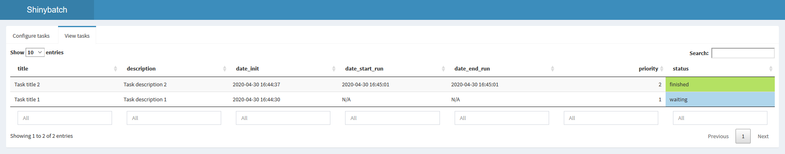
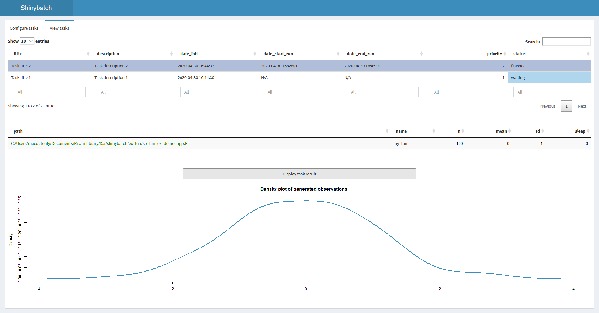

# shinybatch

This package provides a simple framework to create, launch *automatically* and retrieve *time-consuming operations* (tasks) **in batch mode** from a **Shiny app**.

The tasks are automatically launched using a sheduler, e.g. a timer that periodically launches a (batch) operation.
    - a CRON in linux/Mac using **cronR** package
    - In windows with **taskscheduleR** and Windows task scheduler


### Package main functions

- **configure_task** : create a *.yml* file filed with operation parms (fun path, fun args, priority, ...),
- **run_task** : run a task from a *.yml* file,
- **launcher** : select and run the tasks with highest priority,
- **scheduler_init** : create the file to be launched by the *scheduler*,
- **scheduler_add** : (opt: create the cron file) and start the *scheduler* which will read the file at the given frequency to launch batch operations,
- **configure_task_server** : calls *configure_task()* in the Shiny app,
- **tasks_overview_server** : display tasks within the Shiny app.


### Definition of a task

A task is defined by its *.yml* file that contains the following informations :

````{yml}
run_info:
  date_init: 2020-04-24 15:21:00
  date_start_run: N/A
  date_end_run: N/A
  priority: 1.0
  status: waiting
descriptive:
  title: my_title
  description: my_descr
function:
  path: /ath/to/my_fun
  name: my_fun_name
args:
  x: 1.0
  'y':
    _path: /path/to/task/dir/inputs/y.RDS
  z:
    _path: /path/to/task/dir/inputs/z.RDS
dir: /path/to/task/dir/
````


The ``run_info`` part contains general information about the task.

Priority can be any number, with 0 as default. The highest the priority, the sooner it is launched.

Valid status are:

- **waiting**
- **running**
- **finished**
- **error**

The ``descriptive`` part contains free informations given by the user. The title and description fields are only example.

The ``function`` part contains the location of the fun script (for sourcing) and its name (for calling).

The ``args`` part contains either the location of the argument (in *dir_conf/inputs/arg_name.RDS*) or the argument itself if it is of length 1. For more complex argument, we store the data in *.RDS*

The ``dir`` argument contains the location of the directory in which is stored the *conf.yml* file.

When a task has been succesfully run, some fields are updated:

- date_start_run and date_end_run are filled,
- status is set to 'running' then to 'finished'.

Some outputs are created:

- if wanted, the result of the task (in *dir_conf/output/res.RDS*)
- the log of the run (in *dir_conf/output/log_run.txt*)

### Description of the launcher

The launcher retrieves all the tasks in a main directory and build a the table of their *run_info*. Based on this, it verifies that there are tasks with *status* that allow a run, e.g. all but those in *ignore_status*. Then, if the maximum number of simultaneously running tasks is not reached, it launches new tasks according to their priority.

The task with higher priority is defined as the one:

- with *status* not in *ignore_status* (default is all but **waiting**),
- which has the highest *priority*,
- and then the oldest *date_init*.

### Description of the scheduler

Before calling the scheduler, we first create the file that it will launch with **scheduler_init**. By default, it looks like this:

````
#!/usr/bin/env Rscript
args = commandArgs(trailingOnly = TRUE)

shinybatch::launcher(dir_path = args[1], 
                    max_runs = as.integer(args[2])
)
````

... but the head lines can be customized by filling the *head_rows* argument.


Once the file has been created, the cron is launched using the **scheduler_add** function with the default commond : 

``Rscript /path/to/scheduler_script.R /path/to/conf 1``, 


### Example

**Configure a task**
```{r}
require(shinybatch)

?configure_task

# create temporary directory
dir <- tempdir()

# create and save conf
conf <- configure_task(
  dir_path = dir,
  conf_descr = list(title = "my_title",
  description = "my_descr"),
  fun_path = system.file("ex_fun/sb_fun_ex.R", package = "shinybatch"), # as an example,
  fun_name = "sb_fun_ex",
  fun_args = list(x = 1,
  y = 0:4,
  z = iris),
  priority = 1)

# check results
list.files(conf$dir, recursive = T)
(read_conf <- yaml::read_yaml(paste0(conf$dir, "conf.yml")))
(y <- readRDS(paste0(conf$dir, "inputs/y.RDS")))
(z <- readRDS(paste0(conf$dir, "inputs/z.RDS")))
```

**Run one given task**
```{r}
?run_task

run_task(paste0(conf$dir, "conf.yml"))

# catch results
list.files(conf$dir, recursive = T)
(conf_update <- yaml::read_yaml(paste0(conf$dir, "conf.yml")))
(output <- readRDS(paste0(conf$dir, "output/res.RDS")))
(log <- read.delim(list.files(paste0(conf$dir, "output/"), pattern = "log_run", full.names = T), header = F))

```


**Use scheduler to launch the  tasks**
```{r}
?scheduler_add

# create temporary directory for conf
dir_conf <- paste0(tempdir(), "/conf/")
dir.create(dir_conf, recursive = T)

# create 2 confs
conf_1 <- configure_task(
  dir_path = dir_conf,
  conf_descr = list(title_1 = "my_title_1",
               description_1 = "my_descr_1"),
  fun_path = system.file("ex_fun/sb_fun_ex.R", package = "shinybatch"), # as an example,
  fun_name = "sb_fun_ex",
  fun_args = list(x = 0, y = 0:4,  z = iris),
  priority = 1)
  
conf_2 <- configure_task(
  dir_path = dir_conf,
  conf_descr = list(title_1 = "my_title_2",
               description_1 = "my_descr_2"),
  fun_path = system.file("ex_fun/sb_fun_ex.R", package = "shinybatch"), # as an example,
  fun_name = "sb_fun_ex",
  fun_args = list(x = 0, y = 0:4,  z = iris),
  priority = 2)

# on LINUX -> Needed cronR package
# on Windows -> Needed taskscheduleR package

scheduler_add(dir_scheduler = tempdir(),
           dir_conf = dir_conf,
           max_runs = 1,
           create_file = T,
           head_rows = NULL, 
           taskname = "cron_script_ex")
           
scheduler_ls() # display running crons

# wait up to 1 min for conf_2 and up to 2 mins for conf_1
yaml::read_yaml(paste0(conf_1$dir, "/conf.yml"))$run_info$status
yaml::read_yaml(paste0(conf_2$dir, "/conf.yml"))$run_info$status

scheduler_rm(id = "cron_script_ex") # kill all running crons
```

**Shiny modules**

These modules contain the basic framework to use all the previous functions in a Shiny app.
In addition to these modules, the demo app simply includes : 

- **Configure a new task**
 


call:

````
?configure_task_UI

# ui
configure_task_UI("my_id_1") 

# server
# call module to configure a task
# connect app inputs to the module
callModule(configure_task_server, "my_id_1",
  dir_path = dir_conf,
  conf_descr = reactive(list("title" = input$title,
    "description" = input$description)),
  fun_path = paste0(dir_fun, "/fun_script.R"),
  fun_name = "my_fun",
  fun_args = reactive(list(n = input$fun_nb_points,
    mean = input$fun_mean,
    sd = input$fun_sd,
    sleep = input$sleep_time)),
  priority = reactive(input$priority))
```` 


- **Display configured tasks**


call:

````
?tasks_overview_UI

# ui
tasks_overview_UI("my_id_2")

# server
# call module to view tasks
sel_task <- callModule(tasks_overview_server, "my_id_2",
  dir_path = dir_conf,
  allowed_status = c("waiting", "running", "finished", "error"),
  allowed_run_info_cols = NULL,
  allowed_function_cols = NULL,
  allow_descr = T,
  allow_args = T)
                         
````

This module returns : 
- the status of the selected line (one run) of the summmary table,
- the path to the directory in which its output is stored.

Thus we know when a run is finished and we can load its result to reuse/display it : (readRDS(paste0(path, "/res.RDS"))).

**Demo app**

A demo app to create and automatically launch an example task : the generation of normally distributed observations.

- **global** : the path to the confs directory, the path to the script of the function to be run, the call to scheduler_add() ;
- **ui** : shiny inputs (description args for the conf ; parameters for the function to be called bythe cron) ;
- **server** : a renderPlot (a graph of the data create in a run).

As a credible usecase, the results of the runs are retrieved and can be displayed.

The demo app can be launched with function ``run_demo_app()``. 






<br>