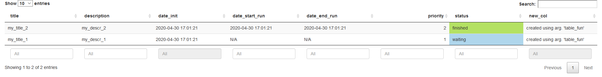
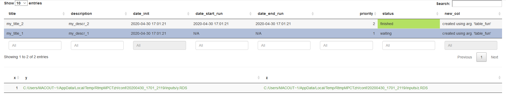

# shinybatch

Dans la famille des packages **shiny** chez **Datastorm**, je demande aujourd'hui le père, à savoir **shinybatch**. **shinybatch** réponds à la problématique suivante : 

Si les utilisateurs *métier* d'une application **shiny** ont besoin de paramétrer, lancer un calcul long à exécuter et pouvant consommant beaucoup de ressources, comment pouvons-nous faire pour leur proposer cela facilement et sans devoir attendre les résultats dans l’application et surcharger le serveur ?

Effectivement : 

- Si on lance ce calcul directement dans la session **shiny**, l'utilisateur devra attendre la fin de son exécution pour pouvoir continuer à explorer l’application. Et en prime, il risque de bloquer les autres utilisateurs potentiels...

- On peut aussi utiliser de la programmation asynchrone avec les packages **promise** et **future**. On déporte alors le calcul en dehors de l'application **shiny**, ce qui fait que l'utilisateur peut continuer à travailler en attendant de récupérer son résultat, cela sans bloquer les autres utilisateurs. C'est donc très pertinent pour des calculs qui nécessitent un certain temps (quelques secondes voir minutes).

Cependant, au-delà de la minute, on doit trouver une alternative. En effet, on imagine mal un utilisateur patientier plusieurs minutes, encore pire plusieurs heures, avec son navigateur ouvert en attendant ses résultats ! 

**shinybatch** a donc été développé pour faciliter la gestion de ces types de calculs, avec :

- Un module pour configurer une tâche (``configure_task_server``)
- Un batch configurable (heure(s) de lancement, nombre maximal de tâches pouvant être exécuter en même temps) pour lancer les tâches (``scheduler_add``, ``launcher``)
- Un module pour voir l’état des tâches et récupérer les résultats (``tasks_overview_server`` & ``tasks_overview_UI``)

### Installation

Le package est déjà largement utilisé chez **Datastorm** dans nos différents projets. Une *V1* arrivera prochainement sur le **CRAN**. En attendant, vous pouvez l'installer directement depuis notre github https://github.com/datastorm-open : 

``` r
if(!require(devtools)) install.packages("devtools")
devtools::install_github("datastorm-open/shinybatch")
```

### Application de démonstration

Une application de démonstration est disponible 

- directement dans le package : 

``` r
shiny::runApp(system.file("demo_app", package = "shinybatch"))
```

- et dans la vidéo ci-dessous

### Fonctionnement

#### Fonctions principales

Concrètement, il suffit d'utiliser les 3 fonctions suivantes : 

- **configure_task_server** : module **shiny** permettant à l'utilisateur de définir une tâche.
- **tasks_overview_server** : module **shiny** pour visualiser les tâches enregistrées, leurs statuts et récupérer les résultats
- **scheduler_add** : Création du script **R** utilisé par le *cron* et définition du *cron*. 

Ces 3 fonctions faisant appel aux autres sous-fonctions disponibles : 

- **configure_task** : Enregistrement des informations de la tâche à effectuer dans un fichier de configuration *.yml* 
- **run_task** : Exécution d'une tâche à partir du fichier de configuration *.yml*
- **launcher** : Sélection et lancement de(s) tâche(s), en appelent **run_task** en *batch* avec la commande *RScript* 
- **scheduler_init** : Création du script **R** utilisé par le *cron*

#### Définition d'une tâche

Une tâche est stockée dans un dossier *parent*, et est définie par un fichier configuration  *.yml* contenant les informations suivantes : 

``` yml
run_info:
  date_creation: 2020-04-24 15:21:00
  date_start: N/A
  date_end: N/A
  priority: 1.0
  status: waiting
descriptive:
  title: my_title
  description: my_descr
function:
  path: /path/to/my_fun
  name: my_fun_name
args:
  x: 1.0
  'y':
    _path: /path/to/task/dir/inputs/y.RDS
  z:
    _path: /path/to/task/dir/inputs/z.RDS
dir: /path/to/task/dir/
```

On retrouve dans la partie ``run_info`` des informations sur la date de création de la tâche, sa priorité et son statut.

- La priorité est un entier, mis à 0 par défaut. Plus elle est elevé, plus la tâche est prioritaire.
- On dénombre 4 statuts : 
    + **waiting**, en attente 
    + **running**, en cours d'exécution
    + **finished**, tâche terminée
    + **error**, erreur pendant l'exécution

La partie ``descriptive`` permet de passer des champs descriptifs libres (ici un titre et une description rapide)

Les informations sur la fonction à lancer sont présentes dans ``function``, avec : 

- **path** : le chemin vers le script **R** principale à sourcer avant de pouvoir lancer le calcul. Ce script doit être autoporteur et contenir toutes les ressources nécessaires (packages, variables, données, sous-fonctions, ...) ainsi que la définition de la fonction principale

``` r
# Load package(s) (if needed)
require(data.table)

# source script(s) (if needed)
source("/path/to/script")

# Load data (if needed)
data <- readRDS("/path/to/script")

# Define main function (needed !)
my_fun_name <- function(x, y, z){
  ...
}
```

- **name** : le nom de la fonction principale

Finalement, les arguments sont stockés dans le champs ``args`` : 

- avec leur valeur directement si possible
- sinon, ils sont enregistrés en *.RDS* dans le répertoire de la tâche (*dir_conf/inputs/arg_name.RDS*)

Quand une tâche est lancée, les champs ``date_start``, ``date_end`` et ``status`` sont modifiés en conséquence. De plus :

- un fichier de log est disponible (*dir_conf/output/log_run.txt*)
- le résultat de la fonction est sauvegardé (*dir_conf/output/res.RDS*)

#### Configuration de lanceur de tâches

Pour ensuite exécuter les tâches enregistrées, **shinybatch** se base sur un ``cron`` en linux ou un ``Task Scheduler`` en windows. Vous pouvez les créer directement, ou bien utiliser la fonction dédiée **scheduler_add**. La commande par défaut étant : 

``Rscript /path/to/scheduler_script.R``

Le *scheduler_script.R* se compose simplement de l'appel à notre ``launcher()`` avec les paramètres souhaités : 

````
#!/usr/bin/env Rscript
args = commandArgs(trailingOnly = TRUE)

shinybatch::launcher(dir_path = '/path/to/main_directory/',
                     max_runs = 1,
                     ignore_status = c('running','finished','error'),
                     delay_reruns = TRUE
)
````
*N.B :* **scheduler_add** crée par défaut ce script **R** en appelant la fonction **scheduler_init**

**Fonctionnement du lanceur :**

La fonction ``launcher()`` regarde toutes les tâches présentes dans le dossier parent. A partir de là : 

- il vérifie que des tâches sont en attente (hors statuts ignorés définis par ``ignore_status``)
- il regarde si des tâches sont en cours d'exécution. Si le nombre maximal de tâches simultanés ``max_runs`` n'est pas atteint, il lance alors des nouvelles tâches :
    + avec la priorité maximale ``priority``
    + et la date de création ``date_creation`` la plus ancienne

### Modules shiny

#### Configuration d'une nouvelle tâche
 
Le module ``configure_task_server`` se compose uniquement d'une partie *server*, et se branche simplement à un bouton défini en amont et permettant de valider l'enregistrement de la tâche. 

Il prend en entrée l'ensemble des informations nécessaires pour la définir (chemin du script **R** principale, nom de la fonction, arguments, ...)
 


``` r 
?configure_task_server

# ui : just create an actionButton
actionButton("go_task", "Configure the task !")

# server
# call module to configure a task
# connect app inputs to the module
callModule(configure_task_server, "my_id_1",
           btn = reactive(input$go_task),
           dir_path = dir_conf,
           conf_descr = reactive(
            list(
              "title" = input$title,
              "description" = input$description
            )
           ),
           fun_path = paste0(dir_fun, "/fun_script.R"),
           fun_name = "my_fun",
           fun_args = reactive(
            list(
              n = input$fun_nb_points,
              mean = input$fun_mean,
              sd = input$fun_sd,
              sleep = input$sleep_time
            )
           ),
           priority = reactive(input$priority)
)
```


#### Visualisation des tâches enregistrées

Le module ``tasks_overview`` permet quant à lui de voir l'avancement des tâches enregistrées, et le cas échéant de récupérer les résultats : 


Il affiche deux tables : 

- une listant toutes les tâches



- et une contenant les informations d'une tâche en particulier, sélectionnée en cliquant sur le premier tableau



Finalement, il retourne côté *server* les informations sur la tâche choisie, ce qui permet donc ensuite de proposer l'affichage / l'exportation des résultats à l'utilisateur !

``` r
?tasks_overview_UI

# ui
tasks_overview_UI("my_id_2")

# server
# call module to view tasks
sel_task <- callModule(
    tasks_overview_server, "my_id_2",
    dir_path = dir_conf
)
```
